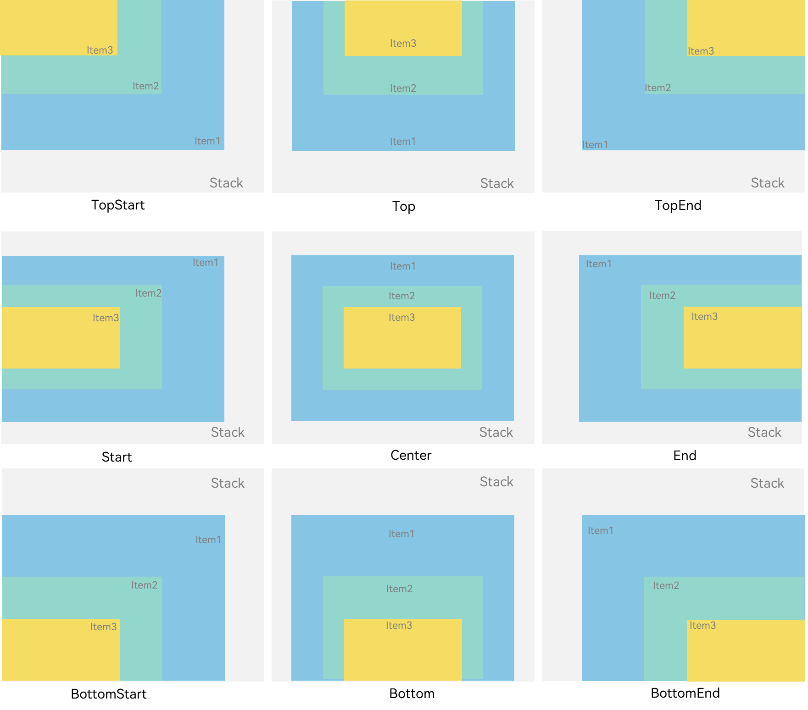

# 鸿蒙demo

#### 介绍
鸿蒙demo

#### 使用说明

1. 常见控件的使用
    * Text
      * 正常使用
      * Span作为子view
    * TextInput ,TextArea
      * placeholder提示
      * onFocus
      * onChange
    * button
      * 正常使用
      * 作为容器使用
      * onClick
    * checkbox
    * image
    * 提示弹窗的使用
      *  PromptAction.showToast({message:''}) 
        * 轻提示（需要引入包，自动关闭），类似android的toast
      *  PromptAction.showDialog({message:''})
        * 弹层提示（需要引入包，点击关闭），类似android的dialog
      *  AlertDialog.show({message:''})
        * 弹层提示（不需要引入包，点击关闭），类似android的dialog

2. 常见布局的使用
    * Column  主轴 justifyContent，交叉轴概念alignItems
    * Row
    * Stack 堆叠布局 
    * Flex 
      * 有性能问题，建议用`Row`和`Column`代替
        * 场景：三个子组件的宽均为200px，容器宽为500px，当第一个子组件和第二个子组件布局完成后，为了显示第三个子组件，需要给第二个子组件和第三个子组件设置压缩属性flexShrink，此时第二个子组件会被再布局一次，导致布局效率下降。
          * 优化： 
          * 使用Column/Row代替Flex。 
          * 大小不需要变更的子组件主动设置flexShrink属性值为0。
          * 优先使用layoutWeight属性替代flexGrow属性和flexShrink属性。 
          * 子组件主轴长度分配设置为最常用场景的布局结果，使子组件主轴长度总和等于Flex容器主轴长度。
   * List
     * 子组件ListItemGroup 用于列表数据的分组展示
     * 子组件ListItem 表示单个列表项
     * 列表的主轴方向：子组件列的排列方向，也是列表的滚动方向
     * List的子组件必须是ListItemGroup或ListItem，ListItem和ListItemGroup必须配合List来使用。
3. 自定义绘制
4. 页面跳转

#### 特技

